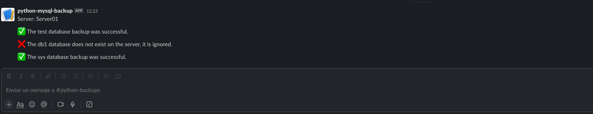

# mysqlbackup-slack

Python script to make MySQL backups with slack messages



## Description

This script is not recommended for use at work level since the database connection data is in a plain file.

This code is a basic example of how to make backups from Python and send message to slack.

## Slack Configuration

In order to configure an application to communicate with Slack,
you must follow the following official Slack procedure: [Slack Docs](https://api.slack.com/messaging/webhooks)

## Usage

In order to install dependencies:

```python
pip install -r requirements.txt
```

In order to run the script:

```python
python3 main.py
```

## variables

The `python-decouple package` is used to load the variables defined in the **.env** file in the root folder

| Name              | Value |
|:------------------|:------|
| DB_HOST           | (`str`) IP or name of mysql server.                                                        |
| DB_PORT           | (`str`) MySQL server listening port.                                                       |
| DB_USER           | (`str`) MySQL user with the necessary permissions to make backups of the database.         |
| DB_PASS           | (`str`) mysql user password                                                                |
| DATABASES         | (`tuple`) List of the databases that you want to make backup copies of.                    |
| BACKUP_FOLDER     | (`str`) Folder where you want to store the databases.                                      |
| LOG_FOLDER        | (`str`) Folder where you want to store the logs.                                           |
| LOG_FILE          | (`str`) Name of the file with which the logs will be created, **do not add an extension**. |
| LOG_LEVEL         | (`str`) Recording level of the logs, **it must be INFO**.                                  |
| LOG_RETENTION     | (`int`) Days that the log files will be stored on your server.                             |
| SLACK_WEBHOOK_URL | (`str`) URL that Slack has generated that the script will use to send messages.            |
| SLACK_FILENAME    | (`str`) Temporary file that will store the messages that will be sent to Slack.            |
